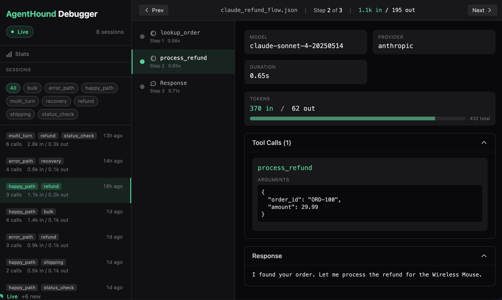
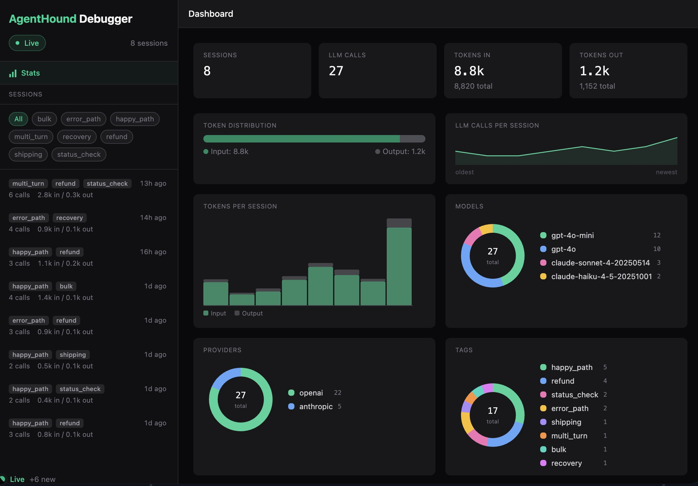

<p align="center">
<pre align="center">
           __
      (___()'`;
      /,    /`
      \\"--\\

</pre>
  <h1 align="center">AgentHound</h1>
  <p align="center"><strong>Sniff out every bug in your agent workflow.</strong></p>
</p>

<p align="center">
  <a href="https://pypi.org/project/agenthound/"></a>
  <a href="https://pypi.org/project/agenthound/"></a>
  <a href="https://github.com/martinwells/agenthound/blob/main/LICENSE"></a>
</p>

---

<p align="center">
  
</p>
<p align="center">
  
</p>

AgentHound is the pytest-native testing framework for AI agent workflows. It records real agent sessions, replays them deterministically, and lets you assert on behavior and correctness — all without making a single API call.

```bash
pip install agenthound            # Core framework
pip install agenthound[ui]        # + debug UI
```

## The Problem

AI agents are the fastest-growing category in software. But they're nearly untestable with existing methods:

- **Non-deterministic** — the same prompt produces different outputs every time
- **Multi-step** — errors cascade through tool calls and decision chains
- **Expensive** — every test run burns tokens and money
- **Slow** — round-trips to LLM APIs add seconds per assertion

The result: 38% of organizations are piloting agents, but only 11% have them in production. The gap is testing.

## The Solution

AgentHound brings the workflow developers already know — **write test, make it pass, ship** — to AI agents:

```python
from agenthound import replay, expect

@replay("tests/fixtures/refund_flow.json")
def test_refund_agent(session):
    result = my_agent.run("I want to return order ORD-123")

    expect(session).tools_called(["lookup_order", "process_refund"])
    expect(session).completed_successfully()
    expect(result).contains("refund")
```

```
$ pytest tests/ -v
tests/test_refund.py::test_refund_agent PASSED        [100%]

============================== 1 passed in 0.02s ==============================
```

Zero API calls. Runs in milliseconds.

## Quickstart

### 1. Record

Run your agent once and capture every LLM call, tool invocation, and token count:

```python
from agenthound import record_session

with record_session("tests/fixtures/refund_flow.json") as session:
    result = my_agent.run("I want to return order ORD-123")
    session.tag("happy_path", "refund")
```

This writes a JSON fixture file. API keys are automatically redacted. Commit it to git alongside your tests.

### 2. Replay

The `@replay` decorator intercepts all HTTP calls and serves the recorded responses. Your agent thinks it's talking to the real API:

```python
from agenthound import replay, expect

@replay("tests/fixtures/refund_flow.json")
def test_refund_agent(session):
    result = my_agent.run("I want to return order ORD-123")

    expect(session).tools_called(["lookup_order", "process_refund"])
    expect(result).contains("refund")
```

### 3. Ship

```bash
pytest tests/ -v
```

No API keys in CI. No network calls. No flaky tests. Just deterministic, sub-second assertions.

## Features

### Mock LLM Responses

Don't want to record first? Define responses inline:

```python
from agenthound import mock_llm, expect

@mock_llm(responses=[
    {"tool_call": "search", "args": {"q": "weather in SF"}},
    "It's 65F and sunny in San Francisco today.",
])
def test_weather_agent(session):
    result = my_agent.run("What's the weather?")

    expect(session).tools_called(["search"])
    expect(session).has_llm_calls(2)
    expect(result).contains("sunny")
```

Works with both providers:

```python
@mock_llm(responses=["Hello from Claude!"], provider="anthropic")
def test_with_claude(session):
    ...
```

### Failure Injection

Test how your agent handles the real world — timeouts, rate limits, broken tools:

```python
from agenthound import replay, inject_failure, expect

@replay("tests/fixtures/refund_flow.json")
@inject_failure(tool="process_refund", error="TimeoutError", at_call=1)
def test_handles_refund_timeout(session):
    result = my_agent.run("I want to return order ORD-123")
    # The agent should retry or degrade gracefully
```

### Token Budgets

Prevent runaway loops and token bloat with first-class assertions:

```python
@replay("tests/fixtures/research_pipeline.json")
def test_research_stays_within_budget(session):
    result = research_agent.run("Analyze the competitive landscape")

    expect(session).total_tokens_under(50000)   # Token budget
    expect(session).max_turns(10)               # Prevent runaway loops
```

### Graduated Assertion Engine

Four layers of assertions. Most tests never need anything beyond Layer 3:

| Layer | What it checks | Example |
|-------|---------------|---------|
| **Schema** | Structure, counts | `has_llm_calls(3)`, `no_errors()`, `all_calls_have_usage()` |
| **Constraints** | Budgets, limits | `total_tokens_under(5000)`, `latency_under(3000)`, `max_turns(5)` |
| **Trace** | Tool behavior | `tools_called(["search", "respond"])`, `tool_called_with("search", {"q": "test"})` |
| **Content** | Response text | `final_response_contains("refund")`, `final_response_matches(r"REF-\d+")` |

Chain them for readable, comprehensive assertions:

```python
(
    expect(session)
    .has_llm_calls(3)
    .tools_called(["lookup_order", "process_refund"])
    .model_used("gpt-4o-mini")
    .no_errors()
    .final_response_contains("refund")
    .final_response_matches(r"REF-\d+")
)
```

## Framework Support

AgentHound intercepts at the `httpx` transport level, so it works with any LLM SDK built on `httpx` — no framework-specific adapters needed:

| Framework | How it works |
|-----------|-------------|
| **OpenAI SDK** | Intercepts `openai.chat.completions.create()` |
| **Anthropic SDK** | Intercepts `anthropic.messages.create()` |
| **LangGraph / LangChain** | Intercepts underlying SDK calls |
| **Pydantic AI** | Intercepts underlying SDK calls |
| **CrewAI** | Intercepts underlying SDK calls |
| **Any httpx-based client** | Intercepted automatically |

## CI/CD

AgentHound is a standard pytest plugin. It works everywhere pytest works:

```yaml
# .github/workflows/test.yml
name: Agent Tests
on: [push, pull_request]

jobs:
  test:
    runs-on: ubuntu-latest
    steps:
      - uses: actions/checkout@v4
      - uses: actions/setup-python@v5
        with:
          python-version: "3.12"
      - run: pip install -e ".[dev]"
      - run: pytest tests/ -v
        # No API keys needed — tests replay from fixtures
```

## API Reference

### Recording

```python
from agenthound import record_session

# Record all LLM calls within the block and save to a fixture file
with record_session("path/to/fixture.json", metadata={"env": "dev"}) as session:
    result = my_agent.run("prompt")
    session.tag("happy_path", "v2")
```

### Replay

```python
from agenthound import replay

# Replay a recorded fixture — all HTTP calls return recorded responses
@replay("path/to/fixture.json", strict=True)
def test_my_agent(session):
    result = my_agent.run("prompt")
```

### Mocking

```python
from agenthound import mock_llm, mock_tool

# Mock LLM responses with a sequence of responses
@mock_llm(responses=["Hello!", {"tool_call": "search", "args": {"q": "test"}}], provider="openai")
def test_with_mock(session):
    ...

# Mock a tool function by import path
@mock_tool("search", target="myapp.tools.search_fn", returns={"results": []})
def test_with_mocked_tool():
    ...
```

### Failure Injection

```python
from agenthound import inject_failure

# Inject an error at the Nth call to a specific tool
@replay("fixtures/session.json")
@inject_failure(tool="process_refund", error="TimeoutError", at_call=1)
def test_failure_handling(session):
    ...
```

### Auto-Record

```python
import agenthound

# Global: capture all LLM calls, split sessions by 2s idle timeout
agenthound.auto_record("sessions/", tags=["dev"], metadata={"env": "local"})
# ... run your agent ...
agenthound.stop_auto_record()

# Per-function: each call becomes a fixture
@agenthound.recorded("sessions/", tags=["support"])
def handle_request(user_input):
    return agent.run(user_input)
```

### OTEL Import

```python
from agenthound.importers.otel import import_otel_trace

import_otel_trace("trace.json", "fixtures/prod-session.json")
```

```bash
agenthound-import otel trace.json fixtures/prod-session.json
```

### Session Assertions

```python
from agenthound import expect

# Schema (Layer 1)
expect(session).has_llm_calls(3)
expect(session).has_llm_calls_between(1, 5)
expect(session).no_errors()
expect(session).all_calls_have_usage()

# Constraints (Layer 2)
expect(session).total_tokens_under(5000)
expect(session).latency_under(3000)
expect(session).max_turns(5)

# Trace (Layer 3)
expect(session).tools_called(["search", "respond"])
expect(session).tools_called_unordered({"search", "respond"})
expect(session).tool_called("search", times=2)
expect(session).tool_called_with("search", {"q": "test"})
expect(session).tool_sequence(["search", "respond"])
expect(session).no_tool_errors()
expect(session).model_used("gpt-4o-mini")
expect(session).completed_successfully()

# Content (Layer 4)
expect(session).final_response_contains("refund")
expect(session).any_response_contains("order")
expect(session).final_response_matches(r"REF-\d+")
```

### Result Assertions

```python
expect(result).contains("refund")
expect(result).matches(r"REF-\d+")
expect(result).equals("expected value")
expect(result).is_type(str)
expect(result).has_field("status", "success")
```

### Session Properties

```python
session.llm_calls          # List[LLMCall] — all LLM calls in order
session.tools_called        # List[str] — ordered tool names
session.tool_retries        # Dict[str, int] — call count per tool
session.total_tokens         # int — total tokens across all calls
session.total_duration_ms    # float — total wall-clock time
session.tags                # List[str] — tags from recording
session.metadata            # Dict — metadata from recording
```

### pytest CLI Options

```bash
pytest --agenthound-record          # Run in recording mode (real API calls)
pytest --agenthound-update          # Re-record existing fixtures
pytest --agenthound-fixtures-dir    # Set fixtures directory (default: tests/fixtures)
```

## Beyond Tests: Auto-Record and Live Debug

AgentHound isn't just for test suites. You can record and debug agent sessions during development and in production.

### Auto-Record

Automatically capture every agent interaction without changing your code:

```python
import agenthound

# Enable global auto-recording — every LLM call is captured
agenthound.auto_record("sessions/")

# Your existing code runs unchanged
result = my_agent.run("Hello")          # -> sessions/2026-03-21T10-00-00_001.json
result = my_agent.run("Return ORD-123") # -> sessions/2026-03-21T10-00-05_002.json

# Disable when done
agenthound.stop_auto_record()
```

Sessions are split automatically: if no API call happens for 2+ seconds, the current session is flushed to a file and a new one starts.

### `@recorded` Decorator

For more control, decorate specific functions so each invocation saves a fixture:

```python
import agenthound

@agenthound.recorded("sessions/", tags=["support"])
def handle_support_request(user_input):
    return agent.run(user_input)

# Each call saves a separate fixture
handle_support_request("Return order ORD-100")
handle_support_request("Where is my order?")
```

### Debug UI

A local web UI for stepping through recorded sessions:

```bash
pip install agenthound[ui]
agenthound-ui --fixtures-dir sessions/
# Open http://127.0.0.1:7600
```

Features:
- **Fixture browser** — see all recorded sessions with tags, tokens, and step count
- **Step-through debugger** — click through each LLM call and tool invocation
- **Step inspector** — see model, tokens, tool arguments, and response text at each step
- **Stats dashboard** — aggregate totals across all sessions: tokens, models, tags, providers
- **Keyboard navigation** — arrow keys to step forward/back
- **Live mode** — toggle live updates to see new sessions appear in real-time as your agent runs

### Live Proxy Mode

The debug UI includes a built-in HTTP proxy that intercepts live LLM calls from your running application — no code changes required. Point your app's SDK at the proxy, and every API call is forwarded to the real provider, recorded as a fixture, and appears in the UI in real-time.

**1. Start the UI (the proxy is included automatically):**

```bash
agenthound-ui --fixtures-dir sessions/ --port 7600
```

**2. Point your app at the proxy:**

The proxy lives at `http://127.0.0.1:7600/proxy`. Set your SDK's base URL to route through it:

```bash
# Anthropic SDK
export ANTHROPIC_BASE_URL=http://127.0.0.1:7600/proxy

# OpenAI SDK
export OPENAI_BASE_URL=http://127.0.0.1:7600/proxy
```

Or set it in code:

```python
from anthropic import Anthropic
client = Anthropic(base_url="http://127.0.0.1:7600/proxy")

from openai import OpenAI
client = OpenAI(base_url="http://127.0.0.1:7600/proxy")
```

**3. Use your app normally.** Every LLM call flows through the proxy to the real API. Responses are returned unchanged. Each group of calls (separated by 5 seconds of idle time) is saved as a fixture file and appears live in the UI.

**Docker:** If your app runs in Docker, use `host.docker.internal` to reach the proxy on the host:

```bash
ANTHROPIC_BASE_URL=http://host.docker.internal:7600/proxy
```

The proxy is transparent — your app behaves exactly as before, but you get full visibility into every prompt, response, and token count.

### Import Production Traces

Convert OpenTelemetry traces from Langfuse, Jaeger, or any OTEL-compatible tool into AgentHound fixtures, then debug them locally:

```bash
agenthound-import otel trace-export.json fixture.json
agenthound-ui --fixtures-dir .
```

Or use the Python API:

```python
from agenthound.importers.otel import import_otel_trace

import_otel_trace("trace-export.json", "fixtures/prod-session.json")
```

## How It Works

AgentHound operates at the `httpx` transport layer — the same HTTP client used internally by both the OpenAI and Anthropic Python SDKs.

**Recording:** A custom `httpx.BaseTransport` wraps the real transport. Every HTTP request and response passes through unchanged, but gets captured into a structured log. On exit, the log is serialized to a JSON fixture file with auth headers automatically redacted.

**Replay:** A different custom transport serves pre-recorded responses in sequence. The Nth HTTP call gets the Nth recorded response. Your agent's code runs exactly as it would in production — it has no idea it's talking to a replay.

**Assertions:** The fixture contains two layers of data. The raw HTTP layer (used by replay) and a semantic layer with parsed LLM calls, tool invocations, and token counts (used by assertions). This separation keeps replay faithful and assertions ergonomic.

```
Your Agent Code
      |
      v
  SDK (OpenAI / Anthropic)
      |
      v
  httpx.Client
      |
      v
  AgentHound Transport  <-- intercepts here
      |
      v
  Real API (recording) or Fixture (replay)
```

## Contributing

```bash
git clone https://github.com/martinwells/agenthound.git
cd agenthound
pip install -e ".[dev]"
pytest tests/ -v
```

## License

MIT
